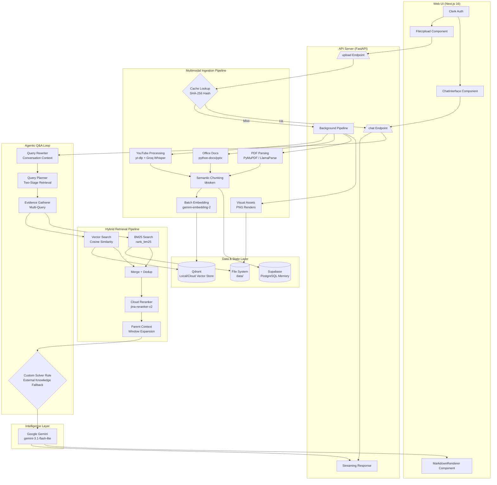

# Omni RAG: Enterprise-Grade Multimodal Intelligence

A production-grade, multimodal Retrieval-Augmented Generation (RAG) system engineered for precision. Omni RAG extracts deep insights from PDFs, Microsoft Office documents (DOCX, PPTX), and YouTube videos. Featuring an interactive Next.js web interface and a robust FastAPI backend, the system utilizes a two-stage hybrid retrieval pipeline (dense vector + sparse lexical), cloud-based cross-encoder reranking, and an advanced Agentic Generation loop powered by Google Gemini.

---

## 🌟 Key Features

- **Multimodal Ingestion Pipeline**: Natively parse PDFs, DOCX, and PPTX files. Extract embedded images, render pages, and automatically download and transcribe YouTube videos using `yt-dlp` and the Groq Whisper API.
- **Hybrid Retrieval Architecture**: Combine the semantic understanding of **Qdrant** vector search with the precise lexical matching of **BM25**, ensuring both meaning and exact keywords are captured.
- **Advanced Agentic Reasoning**: Features a two-stage query planner, query rewriter, and a custom exception handler that intelligently solves assignments/questions found in documents using its own parametric knowledge when answers aren't present in the source context.
- **Enterprise Security & State Management**: Integrated with **Clerk** for robust frontend authentication and **Supabase** for secure, user-scoped conversational memory and database synchronization.
- **Cinematic UI**: A stunning, responsive frontend built with Next.js 16, Tailwind CSS 4, Framer Motion, and dark mode support, featuring streaming markdown responses.

---

## 🏗️ System Architecture



---

## 🔄 Factual Data Flows

### 1. The Multimodal Ingestion Flow (File / YouTube Upload)
When a user uploads a file or submits a YouTube URL via the Next.js frontend:
1. **Validation & Security**: The FastAPI backend authenticates the user via Clerk/Supabase session tokens.
2. **Caching**: A SHA-256 hash is computed. If the document exists in `manifest.json`, ingestion skips instantly (Zero-latency cache hit).
3. **Format-Specific Extraction**:
   - **YouTube URLs**: `yt-dlp` extracts the audio, which is chunked and transcribed via the **Groq Whisper API**.
   - **Office Docs**: `python-docx` and `python-pptx` natively extract text and embedded images.
   - **PDFs**: Text is extracted locally via PyMuPDF (or LlamaParse OCR for scanned docs). Pages are rendered to PNGs for visual context.
4. **Processing**: Text is semantically chunked using `tiktoken` (cl100k_base).
5. **Embedding**: `gemini-embedding-2` converts chunks into vectors in high-performance batches.
6. **Indexing**: Vectors and metadata are upserted into **Qdrant**, while document state and metadata are synced to **Supabase**.

### 2. The Agentic Q&A Flow (Chat)
When a user asks a question in the chat interface:
1. **Context Memory**: The system retrieves the last 5 conversation turns from **Supabase** (or in-memory fallback).
2. **Query Rewriting**: The query is rewritten by the LLM to resolve pronouns and contextual ambiguities.
3. **Two-Stage Planning**: The planner generates up to 4 optimized search queries based on an initial quick-retrieval pass.
4. **Hybrid Retrieval**: Evidence is gathered across all generated queries using:
   - Dense Vector Search (Qdrant)
   - Sparse Lexical Search (BM25)
5. **Reranking & Expansion**: Results are merged, deduplicated, scored by `jina-reranker-v2-base-multilingual`, and expanded with neighboring chunks (Parent Context).
6. **Custom Solver Rule**: If the user is asking to solve assignments/questions found *within* the document (but the document lacks the answers), an explicit system prompt instructs Gemini to use its external parametric knowledge to solve them while citing the process.
7. **Streaming Response**: `gemini-3.1-flash-lite` generates the final answer, streamed via Server-Sent Events (SSE) to the UI's Markdown Renderer.

---

## 📁 Project Structure

```text
pdf-rag/
├── server/                          # FastAPI Python Backend
│   ├── main.py                      # Interactive CLI mode entry point
│   ├── requirements.txt             # Python dependencies
│   ├── app/
│   │   ├── agent/                   # Agentic QA, planner, and evidence gathering logic
│   │   ├── api/                     # FastAPI server, upload handlers, and Groq Whisper integrations
│   │   ├── embeddings/              # Gemini embedding generator (batching support)
│   │   ├── ingestion/               # Document chunker, YouTube processing, and Qdrant indexer
│   │   ├── llm/                     # Google Gemini LLM client
│   │   ├── memory/                  # Conversation history & Supabase memory sync
│   │   ├── parsing/                 # PyMuPDF, Office Docs, LlamaParse, and image extraction
│   │   ├── qa/                      # Context builders and query rewriters
│   │   ├── retrieval/               # Hybrid retrieval (BM25, Qdrant, Jina Reranker, Parent Context)
│   │   └── vectorstore/             # Qdrant and Supabase DB clients
│   └── data/                        # Local storage for vectors, PNG renders, extracted images, and cache
└── web/                             # Next.js 16 Frontend
    ├── app/                         # App Router (Pages, Layouts, Workspace)
    ├── components/                  # Drag-and-drop FileUpload, ChatInterface, MarkdownRenderer
    └── package.json                 # Next.js, Clerk, Supabase, Tailwind v4, Framer Motion
```

---

## 🚀 Tech Stack

| Domain | Technology |
| :--- | :--- |
| **Frontend Framework** | Next.js 16.2.6, React 19, Tailwind CSS 4, Framer Motion |
| **Backend Framework** | Python 3.14+, FastAPI, Uvicorn |
| **Authentication** | Clerk (`@clerk/nextjs`) |
| **Database & Memory** | Supabase (PostgreSQL) |
| **LLM Generation** | Google Gemini (`gemini-3.1-flash-lite`) |
| **Embeddings** | Google Gemini (`gemini-embedding-2`) |
| **Vector Database** | Qdrant (Local Docker or Cloud) |
| **Reranking Engine** | Jina AI Cloud (`jina-reranker-v2-base-multilingual`) |
| **Transcription / Video** | Groq Whisper API, `yt-dlp`, `imageio-ffmpeg` |
| **Document Parsing** | PyMuPDF, `python-docx`, `python-pptx`, LlamaParse OCR |
| **Lexical Search** | `rank_bm25` (BM25Okapi) |

---

## 🛠️ Setup & Installation

### 1. Environment Variables
Create `server/.env` and `web/.env.local`.

**Backend (`server/.env`):**
```env
NODE_ENV=development
GEMINI_API_KEY=your_gemini_key
JINA_API_KEY=your_jina_key
LLAMA_CLOUD_API_KEY=your_llamaparse_key
GROQ_API_KEY=your_groq_whisper_key
QDRANT_URL=http://localhost:6333
# Supabase Configuration
SUPABASE_URL=your_supabase_url
SUPABASE_KEY=your_supabase_anon_key
ALLOWED_ORIGINS=http://localhost:3000
```

**Frontend (`web/.env.local`):**
```env
NEXT_PUBLIC_CLERK_PUBLISHABLE_KEY=your_clerk_pub_key
CLERK_SECRET_KEY=your_clerk_secret_key
NEXT_PUBLIC_SUPABASE_URL=your_supabase_url
NEXT_PUBLIC_SUPABASE_ANON_KEY=your_supabase_anon_key
NEXT_PUBLIC_BASE_API_URL=http://localhost:8000
```

### 2. Infrastructure (Qdrant)
Run Qdrant locally via Docker:
```bash
docker run -d --name qdrant -p 6333:6333 qdrant/qdrant
```

### 3. Backend Setup
```bash
cd server
python -m venv .venv
# Windows: .venv\Scripts\activate | Mac/Linux: source .venv/bin/activate
pip install -r requirements.txt
# Start the API server
uvicorn app.api.server:app --reload --host 0.0.0.0 --port 8000
```

### 4. Frontend Setup
```bash
cd web
npm install
# Start the Next.js development server
npm run dev
```

Navigate to `http://localhost:3000` to authenticate and enter the Omni RAG workspace.

---

## 💡 Production Considerations

This architecture is designed for enterprise-grade scalability:
- **Stateless API**: The FastAPI backend remains entirely stateless. All conversation history and document states are offloaded to Supabase.
- **Asynchronous Processing**: Heavy ingestion tasks (like YouTube audio chunking and Whisper transcription) are offloaded to FastAPI `BackgroundTasks`.
- **Fault-Tolerant Embedding**: The system uses robust exponential backoff algorithms when batching chunks to the Gemini Embedding API to respect rate limits.
- **Deduplication**: Deep document cache checking (SHA-256) guarantees that compute resources are never wasted on previously analyzed documents.
