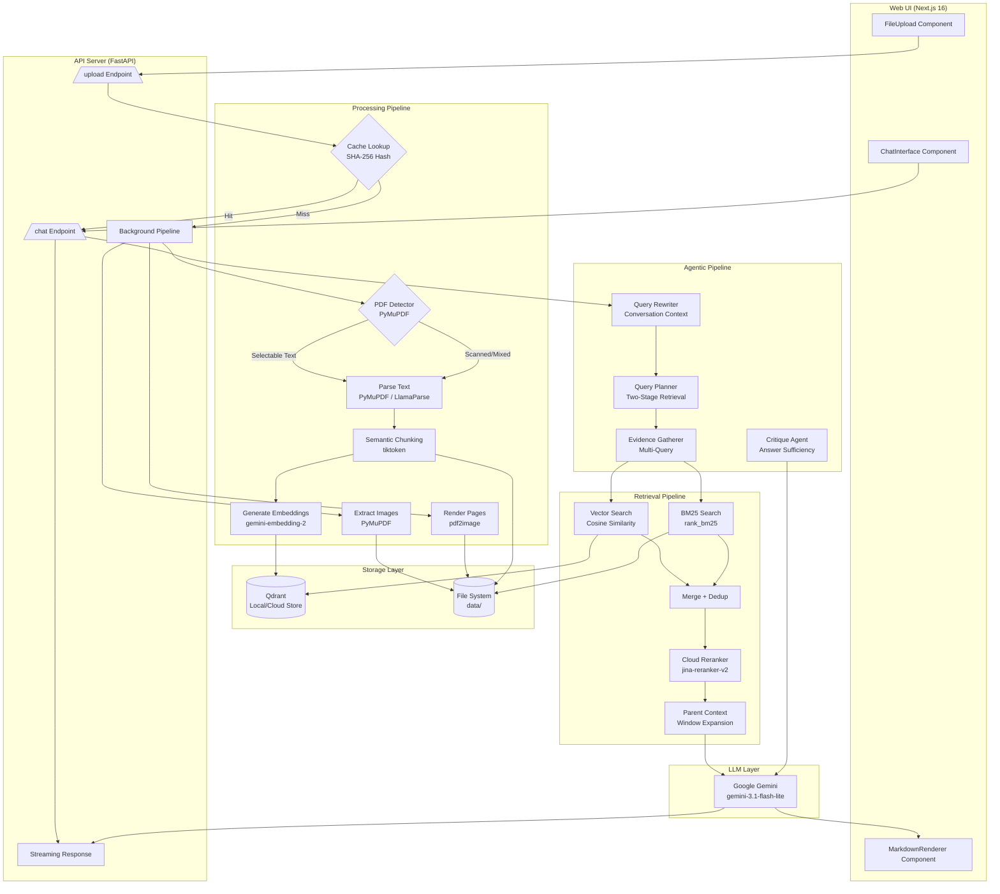
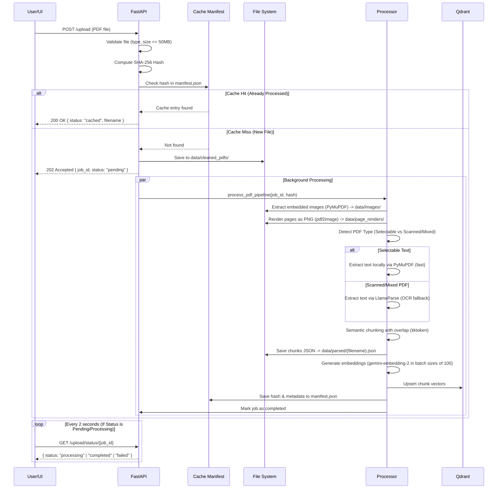
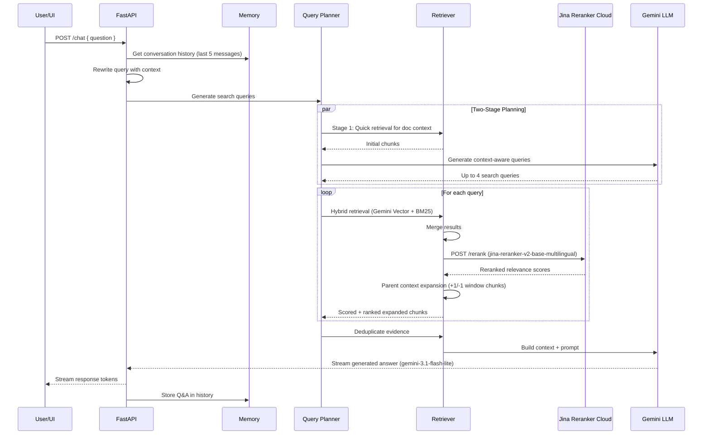

# PDF RAG

A production-grade Retrieval-Augmented Generation (RAG) system for PDF documents. Provides both an interactive CLI for power users and a web interface for visual document Q&A. Supports hybrid retrieval (dense + sparse), cloud-based cross-encoder reranking, parent context expansion, agentic query planning, caching, and multimodal context (embedded images + page renders).

---

## System Architecture



---

## Data Flow Diagrams

### Ingestion Pipeline (PDF Upload)



### Query Pipeline (Question Answering)



---

## Project Structure

```
pdf-rag/
  server/                          # Python backend
    main.py                        # CLI entry point (interactive QA loop)
    pyproject.toml                 # Project metadata (Python >= 3.14)
    requirements.txt               # Python dependencies
    .env                           # API keys & Configuration (gitignored)
    data/
      cache/                       # Ingestion cache directory
        manifest.json              # SHA-256 PDF file cache index
      cleaned_pdfs/                # Uploaded PDF source files
      images/                      # Extracted embedded images (per-PDF folders)
      page_renders/                # Rendered page PNG images (per-PDF folders)
      parsed/                      # Parsed/chunked JSON output
    app/
      agent/
        agentic_qa.py              # Orchestrator: rewrite -> plan -> gather -> answer -> return
        planner.py                 # Two-stage retrieval planner (quick retrieval, then context-aware queries)
        evidence.py                # Evidence gathering across multiple queries with deduplication
        reflection.py              # Critique agent for answer sufficiency evaluation
      api/
        server.py                  # FastAPI application with CORS, /chat streaming, health, and status endpoints
        upload.py                  # PDF upload handler with cache checking and background pipeline processing
      embeddings/
        embedder.py                # Gemini embedding generator (gemini-embedding-2) with batching support
        inference_embedder.py      # HuggingFace InferenceClient (BAAI/bge-m3) as alternative
      eval/
        evaluator.py               # LLM-based RAG evaluation (groundedness, hallucination, relevance, completeness)
      ingestion/
        cache.py                   # Ingestion cache API (SHA-256 hash checking & manifest writing)
        chunker.py                 # Semantic text chunker with overlap, token-count aware (tiktoken)
        index_chunks.py            # Load parsed JSON, generate batch embeddings, index to Qdrant
        process_pdfs.py            # Full pipeline: extract images -> render pages -> parse -> chunk -> save JSON
        process_pdfs_to_md.py      # Simplified pipeline: parse PDFs to markdown only
      llm/
        gemini.py                  # Google Gemini client (generate + stream), model gemini-3.1-flash-lite
      memory/
        memory.py                  # In-memory conversation history (last 5 messages)
      parsing/
        detector.py                # PyMuPDF-based PDF type detector (selectable vs scanned vs mixed)
        parser.py                  # PyMuPDF fast local text parser with LlamaParse fallback
        pymupdf_parser.py          # Fast local parser for selectable-text PDFs
        extract_images.py          # Embedded image extraction using PyMuPDF (fitz)
        render_pages.py            # Page-level rendering to PNG using pdf2image
      qa/
        ask.py                     # Basic Q&A pipeline with context building, image dedup, evaluation
        query_rewriter.py          # Context-aware query rewriting using conversation history
        stream_ask.py              # Streaming Q&A for server mode with markdown formatting
      retrieval/
        retrieve.py                # Hybrid retrieval orchestrator (vectors BM25 merge rerank expand)
        bm25_index.py              # BM25 keyword search index using rank_bm25
        reranker.py                # Cloud reranking using Jina AI (jina-reranker-v2-base-multilingual)
        parent_retrieval.py        # Neighboring chunk expansion for richer context
      vectorstore/
        qdrant_client.py           # Qdrant client connection (Local or Cloud)
        store.py                   # Collection creation and chunk upsertion
  web/                             # Next.js frontend
    app/
      page.tsx                     # Main page: FileUpload + ChatInterface in responsive grid
      layout.tsx                   # Root layout with Geist fonts
      globals.css                  # Tailwind CSS v4 with dark mode support
    components/
      FileUpload.tsx               # Drag-and-drop PDF upload with progress bar, cache-hit feedback, and polling
      ChatInterface.tsx            # Streaming chat widget with message history
      MarkdownRenderer.tsx         # Client-side markdown renderer (bold, italic, code, lists)
    package.json                   # Next.js 16.2.6, React 19.2.4, TypeScript, Tailwind CSS 4
    next.config.ts                 # Next.js configuration
    tsconfig.json                  # TypeScript configuration
    eslint.config.mjs              # ESLint with Next.js core-web-vitals + TypeScript rules
    postcss.config.mjs             # PostCSS with Tailwind CSS
```

---

## Prerequisites

- **Python >= 3.14** (required for the FastAPI backend)
- **Node.js >= 18** (required for the Next.js frontend)
- **Qdrant** running locally (`localhost:6333`) or a **Qdrant Cloud** instance
- **API Keys** for Google Gemini (embeddings & generation), Jina AI (reranking), and LlamaParse (fallback OCR)

---

## Setup

### 1. Environment Variables

Create `server/.env` with the following configuration:

```env
# Google Gemini API Key
GEMINI_API_KEY=your_google_gemini_api_key

# Jina AI Cloud Reranker API Key
JINA_API_KEY=your_jina_api_key

# Llama Cloud API Key (Only used as OCR fallback for scanned/mixed PDFs)
LLAMA_CLOUD_API_KEY=your_llamaparse_api_key

# Qdrant Configuration (Defaults to http://localhost:6333 if omitted)
QDRANT_URL=https://your-qdrant-cluster.io:6333
QDRANT_API_KEY=your_qdrant_api_key

# CORS Configuration (Comma-separated list of origins, or "*" for wildcard)
ALLOWED_ORIGINS=http://localhost:3000,https://your-app.vercel.app

# Optional (HuggingFace Integration)
HF_TOKEN=your_huggingface_token
```

### 2. Qdrant Setup
If running Qdrant locally, start it using Docker:

```bash
docker run -d --name qdrant -p 6333:6333 qdrant/qdrant
```

Verify it is running:
```bash
curl http://localhost:6333/collections
```

### 3. Backend Setup

```bash
cd server

# Create and activate virtual environment (Windows)
python -m venv .venv
.venv\Scripts\activate

# Create and activate virtual environment (macOS/Linux)
# python -m venv .venv
# source .venv/bin/activate

# Install Python dependencies
pip install -r requirements.txt
```

### 4. Frontend Setup

```bash
cd web
npm install
```

---

## Usage

### CLI Mode (Interactive Question-Answer Loop)

The CLI mode provides a terminal-based interactive session for querying PDF documents.

```bash
# Step 1: Ensure your PDFs are parsed and indexed
cd server

# If you have PDFs in data/cleaned_pdfs/ that are not yet indexed:
python -m app.ingestion.process_pdfs
python -m app.ingestion.index_chunks

# Step 2: Start the interactive CLI
python main.py
```

Once started, you will see:
```
PDF RAG System Ready

Ask Question:
```

Type your questions and press Enter. The system will:
1. Rewrite your question using conversation context
2. Generate optimized search queries via the two-stage planner
3. Retrieve evidence using hybrid search (Gemini Vector + BM25 + Jina Reranker)
4. Generate an answer using Google Gemini (`gemini-3.1-flash-lite`)
5. Display the answer along with search queries, sources, and relevance scores

Type `exit` or `quit` to stop the CLI.

### Server Mode (Web UI)

Run the backend API server and the frontend development server simultaneously.

**Terminal 1 - Backend API Server:**
```bash
cd server
uvicorn app.api.server:app --reload --host 0.0.0.0 --port 8000
```
The API server starts at `http://localhost:8000` with interactive docs at `http://localhost:8000/docs`.

**Terminal 2 - Frontend Dev Server:**
```bash
cd web
npm run dev
```
The Next.js frontend starts at `http://localhost:3000`.

Open `http://localhost:3000` in a browser. The UI presents two panels:
- **Left Panel (Upload PDF)**: Drag-and-drop or click to upload a PDF. Displays upload progress, processing status, and a progress bar. Includes support for instant cache-hits (if a document has been processed previously, ingestion completes instantly).
- **Right Panel (Chat)**: Ask questions about the uploaded PDF. Responses are streamed in real-time with markdown rendering (bold, italic, code blocks, lists).

### Production Deployment

For production, build the frontend and serve it alongside the API:

```bash
# Build the Next.js frontend
cd web
npm run build

# Start the production server
npm start

# Run the backend with uvicorn in production mode
cd server
uvicorn app.api.server:app --host 0.0.0.0 --port 8000 --workers 4
```

---

## API Reference

### Chat

**POST** `/chat`

Ask a question and receive a streaming markdown response.

*Request Body:*
```json
{
  "question": "What is the main finding in chapter 3?"
}
```

*Response:* `text/plain` streaming response with markdown-formatted answer.

### Upload PDF

**POST** `/upload`

Upload a PDF file for processing. Accepted as `multipart/form-data`.

- Maximum file size: 50 MB
- Accepted format: PDF only
- Computes SHA-256 hash to check for cache hits. If the document is cached, returns a `200 OK` status immediately, skipping pipeline execution.
- If not cached, returns a `202 Accepted` status with a `job_id` for tracking background processing.

*Request:* `multipart/form-data` with field name `file`.

*Response (200 OK - Cache Hit):*
```json
{
  "message": "File already processed (cached)",
  "filename": "document.pdf",
  "parsed_path": "data/parsed/document.json",
  "status": "cached"
}
```

*Response (202 Accepted - New File Ingestion Started):*
```json
{
  "message": "File uploaded successfully, processing started",
  "job_id": "550e8400-e29b-41d4-a716-446655440000",
  "filename": "document.pdf",
  "status": "pending"
}
```

### Upload Status

**GET** `/upload/status/{job_id}`

Poll the processing status of an uploaded PDF.

*Response:*
```json
{
  "job_id": "550e8400-e29b-41d4-a716-446655440000",
  "filename": "document.pdf",
  "status": "processing",
  "created_at": "2026-05-18T10:30:00",
  "completed_at": null,
  "error": null
}
```

Status values: `pending`, `processing`, `completed`, `failed`.

### List Jobs

**GET** `/upload/jobs`

List all upload processing jobs.

### List Files

**GET** `/upload/files`

List all uploaded PDF files on the server.

*Response:*
```json
{
  "files": ["document.pdf", "report.pdf"]
}
```

### Health Check

**GET** / **HEAD** `/health`

Get system status and health probes. The `HEAD` method returns an empty body for fast, lightweight heartbeat checks.

*Response (GET):*
```json
{
  "status": "ok",
  "uptime_seconds": 12345
}
```

---

## Ingestion Pipeline Details

The system handles document processing through an optimized workflow:

1. **SHA-256 Hashing**: Checks the file hash against `data/cache/manifest.json`. If it exists, the pipeline instantly completes.
2. **Visual Asset Extraction**: Extracts embedded images and renders pages to PNGs for visual QA support.
3. **Smart Parsing**: 
   - Selectable text PDFs are parsed locally using **PyMuPDF**, which takes a few milliseconds and does not require cloud APIs.
   - Scanned or mixed PDFs fall back to **LlamaParse**'s high-fidelity OCR engine.
4. **Token-Aware Semantic Chunking**: Splits document text into chunks based on semantic paragraphs while keeping track of token lengths using `tiktoken` to optimize boundaries.
5. **Batch Embedding**: Converts chunks to vectors using `gemini-embedding-2` in batches of 100 to maximize performance.
6. **Vector Indexing**: Saves vectors to Qdrant (local or cloud) alongside chunk text, metadata, and rendering paths.

---

## Retrieval & Generation Details

### Stage 1: Dense Vector Search
- **Model**: `gemini-embedding-2` via Google Gemini
- **Store**: Qdrant Vector DB (Cosine distance)
- **Top-K**: 10 results

### Stage 2: BM25 Sparse Search
- **Algorithm**: `BM25Okapi` via `rank_bm25`
- **Top-K**: 10 results
- Performs keyword-level lexical matching on tokenized document chunks.

### Stage 3: Merge and Deduplicate
- Combines dense vector and BM25 sparse search results into a unified list.
- Deduplicates chunks based on their unique UUIDs while preserving their relative search metrics.

### Stage 4: Cloud Cross-Encoder Reranking
- **Model**: `jina-reranker-v2-base-multilingual` via Jina AI Cloud API
- **Top-K**: 5 results after reranking
- Scores query-chunk pairs jointly, resolving semantic nuances that embedding models alone may miss.

### Stage 5: Parent Context Expansion
- Retrieves neighboring chunks (prev/next chunks) from the parsed document structure to give the generator richer surrounding context.

### Stage 6: Generation & Evaluation
- **LLM**: Google Gemini (`gemini-3.1-flash-lite`) with streaming enabled.
- **Evaluation**: The answer is graded by an LLM-based evaluator scoring Groundedness, Hallucination Risk, Context Relevance, and Completeness on a 0-10 scale.

---

## Tech Stack

| Layer | Technology |
| :--- | :--- |
| **Backend Framework** | Python 3.14+, FastAPI, Uvicorn |
| **Frontend UI** | Next.js 16.2.6, React 19.2.4, TypeScript, Tailwind CSS 4 |
| **LLM Generation** | Google Gemini (`gemini-3.1-flash-lite`) |
| **Embeddings API** | `gemini-embedding-2` (Google Gemini with batch size of 100) |
| **Vector Database** | Qdrant (Local Docker or Qdrant Cloud, Cosine distance) |
| **Reranking Engine** | Jina AI Cloud (`jina-reranker-v2-base-multilingual`) |
| **PDF Parsing & OCR** | PyMuPDF (Fast selectable text) & LlamaParse (OCR fallback) |
| **Token Tracking** | `tiktoken` (cl100k_base encoding) |
| **Caching Store** | Local file hashing cache (`data/cache/manifest.json`) |
| **Keyword Search** | `rank_bm25` (BM25Okapi) |

---

## Troubleshooting

| Problem | Solution |
| :--- | :--- |
| **Qdrant connection refused** | If local: check Docker is running: `docker start qdrant`. If cloud: check `QDRANT_URL` and `QDRANT_API_KEY` in `.env`. |
| **LlamaParse API error** | Verify `LLAMA_CLOUD_API_KEY` is active and correctly pasted in `server/.env`. |
| **Gemini API error** | Verify `GEMINI_API_KEY` has active quotas for generation and embeddings. |
| **Jina Reranker error** | Ensure `JINA_API_KEY` is set in `server/.env` and has sufficient credits. |
| **No chunks retrieved** | If indexing was skipped or failed, run `python -m app.ingestion.index_chunks` manually. |
| **CORS error in browser** | Check `ALLOWED_ORIGINS` in your `server/.env` includes your frontend URL (e.g. `http://localhost:3000`). |
| **ImportError on startup** | Ensure your virtual environment is active (`.venv\Scripts\activate` or `source .venv/bin/activate`) and dependencies are up to date (`pip install -r requirements.txt`). |
