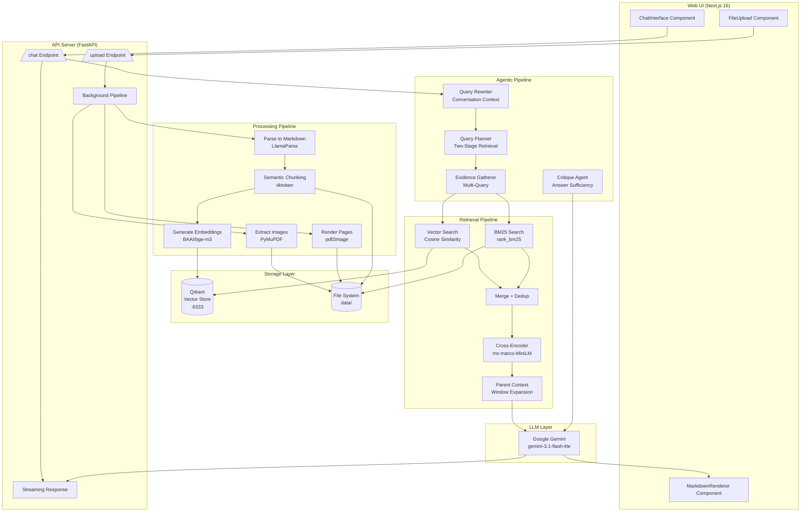
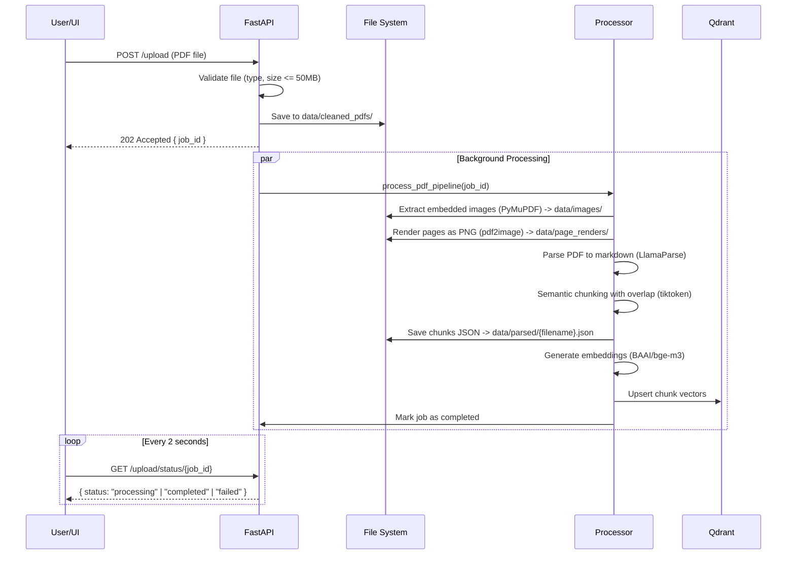
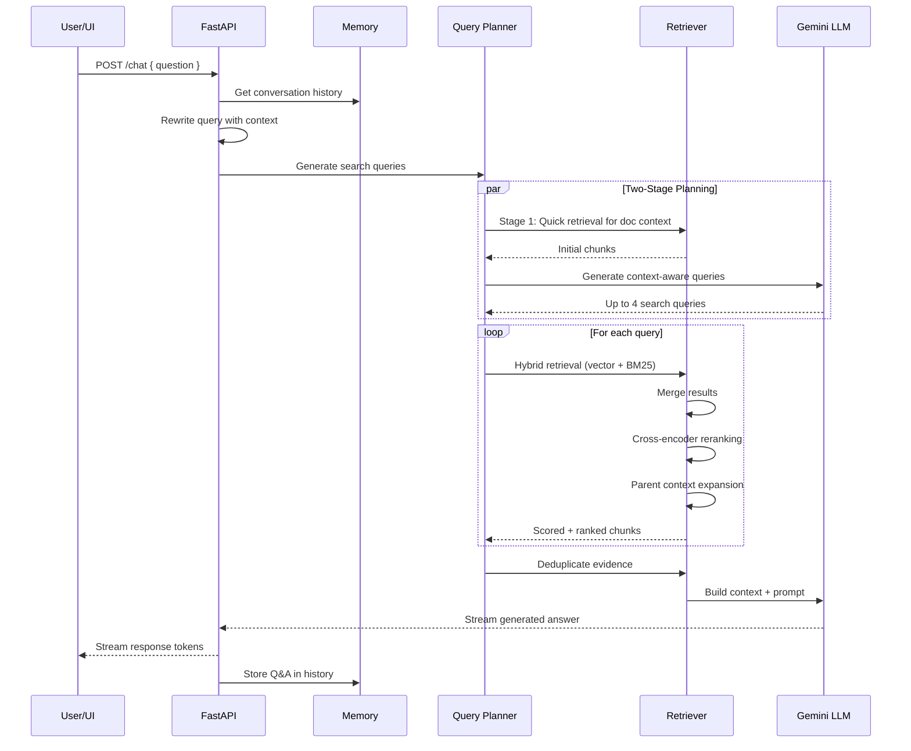
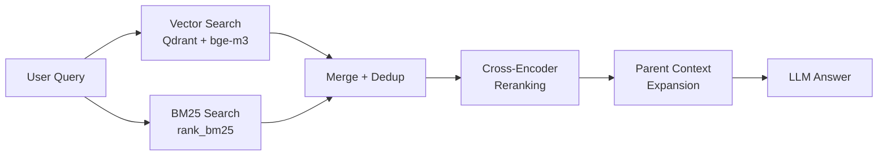
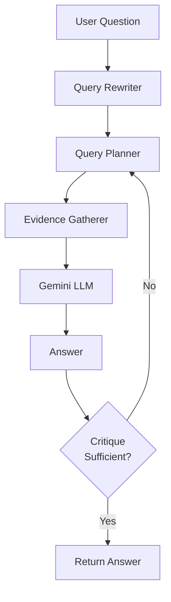

# PDF RAG

A production-grade Retrieval-Augmented Generation (RAG) system for PDF documents. Provides both an interactive CLI for power users and a web interface for visual document Q&A. Supports hybrid retrieval (dense + sparse), cross-encoder reranking, parent context expansion, agentic query planning, and multimodal context (embedded images + page renders).

## System Architecture



## Data Flow Diagrams

### Ingestion Pipeline (PDF Upload)



### Query Pipeline (Question Answering)



## Project Structure

```
pdf-rag/
  server/                          # Python backend
    main.py                        # CLI entry point (interactive QA loop)
    pyproject.toml                 # Project metadata (Python >= 3.14)
    requirements.txt               # Python dependencies
    .env                           # API keys (gitignored)
    data/
      cleaned_pdfs/                # Uploaded PDF source files
      images/                      # Extracted embedded images (per-PDF folders)
      page_renders/                # Rendered page PNG images (per-PDF folders)
      parsed/                      # Parsed/chunked JSON output
    app/
      agent/
        agentic_qa.py              # Orchestrator: rewrite -> plan -> gather -> answer -> return
        planner.py                 # Two-stage retrieval planner (quick retrieval, then context-aware queries)
        evidence.py                # Evidence gathering across multiple queries with deduplication
        reflection.py              # Critique agent for answer sufficiency evaluation
      api/
        server.py                  # FastAPI application with CORS, /chat streaming, /upload endpoints
        upload.py                  # PDF upload handler with background pipeline processing and job tracking
      embeddings/
        embedder.py                # Sentence-transformers (BAAI/bge-m3) with local inference
        inference_embedder.py      # HuggingFace InferenceClient (BAAI/bge-m3) as alternative
      eval/
        evaluator.py               # LLM-based RAG evaluation (groundedness, hallucination, relevance, completeness)
      ingestion/
        chunker.py                 # Semantic text chunker with overlap, token-count aware (tiktoken)
        index_chunks.py            # Load parsed JSON, generate embeddings, index to Qdrant
        process_pdfs.py            # Full pipeline: extract images -> render pages -> parse -> chunk -> save JSON
        process_pdfs_to_md.py      # Simplified pipeline: parse PDFs to markdown only
      llm/
        gemini.py                  # Google Gemini client (generate + stream), model gemini-3.1-flash-lite
      memory/
        memory.py                  # In-memory conversation history (last 5 messages)
      parsing/
        parser.py                  # PDF to structured markdown via LlamaParse + llama-index
        extract_images.py          # Embedded image extraction using PyMuPDF (fitz)
        render_pages.py            # Page-level rendering to PNG using pdf2image
      qa/
        ask.py                     # Basic Q&A pipeline with context building, image dedup, evaluation
        query_rewriter.py          # Context-aware query rewriting using conversation history
        stream_ask.py              # Streaming Q&A for server mode with markdown formatting
      retrieval/
        retrieve.py                # Hybrid retrieval orchestrator (vectors BM25 merge rerank expand)
        bm25_index.py              # BM25 keyword search index using rank_bm25
        reranker.py                # Cross-encoder reranking (ms-marco-MiniLM-L-6-v2)
        parent_retrieval.py        # Neighboring chunk expansion for richer context
      vectorstore/
        qdrant_client.py           # Qdrant client connection (localhost:6333)
        store.py                   # Collection creation and chunk upsertion
  web/                             # Next.js frontend
    app/
      page.tsx                     # Main page: FileUpload + ChatInterface in responsive grid
      layout.tsx                   # Root layout with Geist fonts
      globals.css                  # Tailwind CSS v4 with dark mode support
    components/
      FileUpload.tsx               # Drag-and-drop PDF upload with progress bar and job polling
      ChatInterface.tsx            # Streaming chat widget with message history
      MarkdownRenderer.tsx         # Client-side markdown renderer (bold, italic, code, lists)
    package.json                   # Next.js 16.2.6, React 19.2.4, TypeScript, Tailwind CSS 4
    next.config.ts                 # Next.js configuration
    tsconfig.json                  # TypeScript configuration
    eslint.config.mjs              # ESLint with Next.js core-web-vitals + TypeScript rules
    postcss.config.mjs             # PostCSS with Tailwind CSS
```

## Prerequisites

- **Python >= 3.14** (required for the FastAPI backend)
- **Node.js >= 18** (required for the Next.js frontend)
- **Qdrant** running on `localhost:6333` (vector store)
- **API Keys** for Google Gemini, LlamaParse, and optionally HuggingFace

## Setup

### 1. Environment Variables

Create `server/.env` with the following keys:

```env
LLAMA_CLOUD_API_KEY=your_llamaparse_api_key
GEMINI_API_KEY=your_google_gemini_api_key
HF_TOKEN=your_huggingface_token         # optional, only needed for inference embedder
```

### 2. Qdrant (Vector Store)

Start Qdrant using Docker:

```bash
docker run -d --name qdrant -p 6333:6333 qdrant/qdrant
```

Verify it is running:

```bash
curl http://localhost:6333/collections
```

### 3. Backend Setup

```bash
cd server

# Create and activate virtual environment (Windows)
python -m venv .venv
.venv\Scripts\activate

# Create and activate virtual environment (macOS/Linux)
# python -m venv .venv
# source .venv/bin/activate

# Install Python dependencies
pip install -r requirements.txt
```

### 4. Frontend Setup

```bash
cd web
npm install
```

## Usage

### CLI Mode (Interactive Question-Answer Loop)

The CLI mode provides a terminal-based interactive session for querying PDF documents.

```bash
# Step 1: Ensure your PDFs are parsed and indexed
cd server

# If you have PDFs in data/cleaned_pdfs/ that are not yet indexed:
python -m app.ingestion.process_pdfs
python -m app.ingestion.index_chunks

# Step 2: Start the interactive CLI
python main.py
```

Once started, you will see:

```
PDF RAG System Ready

Ask Question:
```

Type your questions and press Enter. The system will:
1. Rewrite your question using conversation context
2. Generate optimized search queries via the two-stage planner
3. Retrieve evidence using hybrid search (vector + BM25 + reranker)
4. Generate an answer using Google Gemini
5. Display the answer along with search queries, sources, and relevance scores

Example output:

```
Ask Question: What is the main topic of this document?

====================

========== SEARCH QUERIES ==========

- main topic document overview
- document key themes and subjects
- central focus of the document
- primary subjects discussed

Rewritten Query: What is the main topic and central subject of the document?

The document primarily discusses ...


========== SOURCES ==========

        CHUNK: a1b2c3d4-e5f6-7890-abcd-ef1234567890

        FILE: 1.pdf

        PAGE: 1

        VECTOR: 0.8921

        BM25: 0.7543

        RERANK: 8.2345

        PREVIEW:
        ...

        ----------------------------
```

Type `exit` or `quit` to stop the CLI.

### Server Mode (Web UI)

Run the backend API server and the frontend development server simultaneously.

**Terminal 1 - Backend API Server:**

```bash
cd server
uvicorn app.api.server:app --reload --host 0.0.0.0 --port 8000
```

The API server starts at `http://localhost:8000` with interactive docs at `http://localhost:8000/docs`.

**Terminal 2 - Frontend Dev Server:**

```bash
cd web
npm run dev
```

The Next.js frontend starts at `http://localhost:3000`.

Open `http://localhost:3000` in a browser. The UI presents two panels:

- **Left Panel (Upload PDF)**: Drag-and-drop or click to upload a PDF. Displays upload progress, processing status, and a progress bar. Polls the job status every 2 seconds until completion.
- **Right Panel (Chat)**: Ask questions about the uploaded PDF. Responses are streamed in real-time with markdown rendering (bold, italic, code blocks, lists).

### Production Deployment

For production, build the frontend and serve it alongside the API:

```bash
# Build the Next.js frontend
cd web
npm run build

# Start the production server
npm start

# Run the backend with uvicorn in production mode
cd server
uvicorn app.api.server:app --host 0.0.0.0 --port 8000 --workers 4
```

## API Reference

### Chat

**POST** `/chat`

Ask a question and receive a streaming markdown response.

Request body:

```json
{
  "question": "What is the main finding in chapter 3?"
}
```

Response: `text/plain` streaming response with markdown-formatted answer.

### Upload PDF

**POST** `/upload`

Upload a PDF file for processing. Accepted as `multipart/form-data`.

- Maximum file size: 50 MB
- Accepted format: PDF only
- Returns a `job_id` for tracking background processing status

Request: `multipart/form-data` with field name `file`.

Response (202 Accepted):

```json
{
  "message": "File uploaded successfully, processing started",
  "job_id": "550e8400-e29b-41d4-a716-446655440000",
  "filename": "document.pdf",
  "status": "pending"
}
```

### Upload Status

**GET** `/upload/status/{job_id}`

Poll the processing status of an uploaded PDF.

Response:

```json
{
  "job_id": "550e8400-e29b-41d4-a716-446655440000",
  "filename": "document.pdf",
  "status": "processing",
  "created_at": "2026-05-18T10:30:00",
  "completed_at": null,
  "error": null
}
```

Status values: `pending`, `processing`, `completed`, `failed`.

### List Jobs

**GET** `/upload/jobs`

List all upload processing jobs.

### List Files

**GET** `/upload/files`

List all uploaded PDF files on the server.

Response:

```json
{
  "files": ["document.pdf", "report.pdf"]
}
```

## Ingestion

### Via Web UI

1. Open `http://localhost:3000`
2. Drag a PDF onto the upload panel or click to select a file
3. Wait for processing to complete (progress bar updates automatically)
4. Start asking questions in the chat panel

### Via CLI (Batch Processing)

Place PDF files directly into `server/data/cleaned_pdfs/` and run the ingestion pipeline manually:

```bash
cd server

# Step 1: Process PDFs (extract images, render pages, parse, and chunk)
python -m app.ingestion.process_pdfs

# Step 2: Index chunks into Qdrant
python -m app.ingestion.index_chunks
```

### Via API

```bash
curl -X POST http://localhost:8000/upload \
  -F "file=@/path/to/document.pdf"
```

## Retrieval Pipeline Details

The system uses a multi-stage hybrid retrieval strategy to maximize both precision and recall:



### Stage 1: Dense Vector Search

- **Model**: BAAI/bge-m3 via sentence-transformers
- **Store**: Qdrant vector database (cosine distance)
- **Top-K**: 10 results
- Embeds the query, searches the vector index, returns chunks with cosine similarity scores

### Stage 2: BM25 Sparse Search

- **Algorithm**: BM25Okapi via rank_bm25
- **Top-K**: 10 results
- Tokenizes both the query and all document chunks, scores based on term frequency and inverse document frequency

### Stage 3: Merge and Deduplicate

- Combines vector and BM25 results into a single unified list
- Deduplicates by chunk ID, preserving scores from both retrievers
- Chunks found by both retrievers retain both vector and BM25 scores

### Stage 4: Cross-Encoder Reranking

- **Model**: cross-encoder/ms-marco-MiniLM-L-6-v2
- **Top-K**: 5 results after reranking
- Evaluates query-chunk pairs jointly (not just embedding similarity), producing more accurate relevance scores
- Reranked chunks sorted by descending rerank score

### Stage 5: Parent Context Expansion

- Window size: 1 (includes one chunk before and after each retrieved chunk)
- Loads the full document JSON and expands each retrieved chunk with its immediate neighbors
- Preserves all retrieval scores for the originally retrieved chunk

## Agentic Pipeline Details



### Query Rewriting

- Maintains conversation history (last 5 messages)
- Rewrites the user's question to be self-contained, resolving pronouns and references
- Preserves the original meaning while incorporating context from previous turns

### Two-Stage Query Planning

1. **Stage 1**: Quick initial retrieval to understand the document domain
2. **Stage 2**: Generates up to 4 context-aware search queries based on the retrieved document content
3. Queries are optimized to explore different facets of the question

### Evidence Gathering

- For each of the generated queries, performs full hybrid retrieval
- Deduplicates results across all queries
- Returns a consolidated set of relevant chunks

### Critique / Reflection

- Evaluates the generated answer against the evidence
- Assesses sufficiency, missing information, and retrieval completeness
- Can trigger additional search queries if the answer is insufficient

## Evaluation Metrics

The system includes an LLM-based evaluator that scores each answer on four dimensions (0-10 scale):

| Metric             | Description                                      |
|--------------------|--------------------------------------------------|
| Groundedness       | Is the answer supported by the retrieved context?|
| Hallucination Risk | Did the answer invent unsupported claims?        |
| Context Relevance  | Were the retrieved chunks relevant to the question?|
| Completeness       | Did the answer fully address the question?       |

## Tech Stack

| Layer              | Technology                                           |
|--------------------|------------------------------------------------------|
| Backend Framework  | Python 3.14+, FastAPI, Uvicorn                       |
| Frontend           | Next.js 16.2.6, React 19.2.4, TypeScript, Tailwind CSS 4 |
| LLM                | Google Gemini (gemini-3.1-flash-lite)                |
| Vector Store       | Qdrant (localhost:6333, cosine distance)             |
| PDF Parsing        | LlamaParse, PyMuPDF (fitz), pdf2image                |
| Embeddings         | BAAI/bge-m3 (sentence-transformers)                  |
| Reranking          | cross-encoder/ms-marco-MiniLM-L-6-v2                 |
| Keyword Search     | rank_bm25 (BM25Okapi)                                |
| Text Chunking      | tiktoken (cl100k_base encoding)                      |
| Package Manager    | pip (Python), npm (Node.js)                          |

## Troubleshooting

| Problem                          | Solution                                               |
|----------------------------------|--------------------------------------------------------|
| Qdrant connection refused        | Ensure Docker container is running: `docker start qdrant` |
| LlamaParse API error             | Verify `LLAMA_CLOUD_API_KEY` is set in server/.env     |
| Gemini API error                 | Verify `GEMINI_API_KEY` is set in server/.env          |
| No chunks retrieved              | Run `python -m app.ingestion.index_chunks` to index PDFs |
| PDF upload fails                 | Check file is valid PDF and under 50MB                 |
| CORS error in browser            | Ensure backend is running on port 8000 and frontend on 3000 |
| ImportError on startup           | Activate virtual environment and run `pip install -r requirements.txt` |
